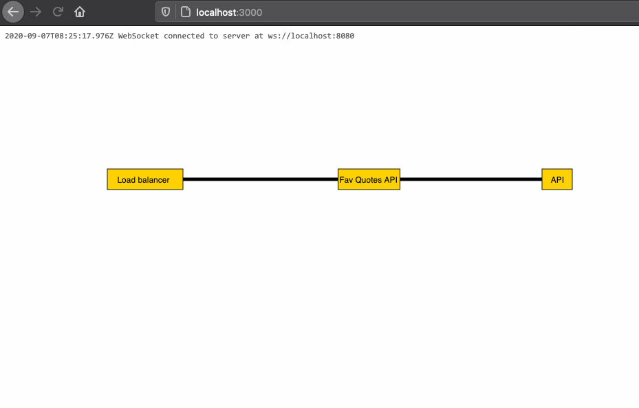

# SVGmonit, turn a system overview in SVG into a live network monitor

The simplest live system overview monitor that runs http checks directly from an in SVG thats for example exported from yEd. Add CHECK-tag to any HTTP/HTTPS endpoint to the SVG and thats it. Links added to the SVG will also be interactive and will be opened in new window.
Small Node.js-server updating the SVG with status colors of i.e. a network link between two systems.

Today the only check is if the url returns 200 ok.

## Get started
1. Draw a system overview in [yEd](https://www.yworks.com/products/yed)
2. On one or more elements under "Data" add "Description", CHECK|{URL} ex. CHECK|http://exemple.com
3. Export to SVG-format
4. Place in svg-img folder
5. Update config.js
5. `npm install`
6. `npm start`
